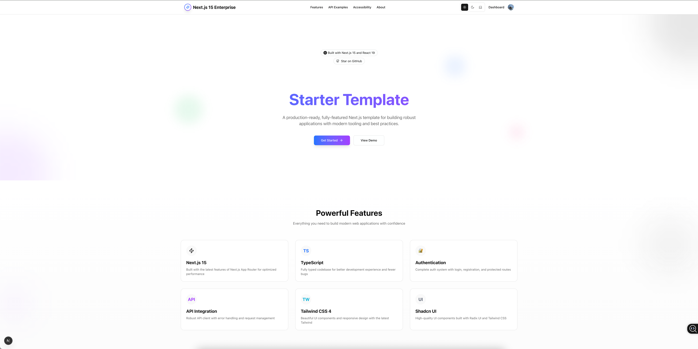

# Next.js 15 Enterprise Starter [[LIVE DEMO](https://nextjs-15-starter-shadcn.vercel.app/)]

 [](https://typescriptlang.org)    [](https://saythanks.io/to/siddharthamaity)

*This is the enhanced version of Next.js 15 Starter with Shadcn UI. You may be interested in other templates too -*
- [**Next.js 15 Starter Core**](https://github.com/SiddharthaMaity/nextjs-15-starter-core)
- [**Next.js 15 Starter with Tailwind CSS**](https://github.com/SiddharthaMaity/nextjs-15-starter-tailwind)

Welcome to the **Next.js 15 Enterprise Starter** repository! This starter template is built with Next.js 15, React 19, TypeScript 5, Tailwind CSS 4, Shadcn UI and comes packed with several powerful tools and configurations to accelerate your project setup and streamline development workflows.




## 🚀 What's Included

- **Next.js 15** with App Router
- **React 19** with latest features
- **TypeScript 5** for type safety
- **ESLint 9** for code quality
- **Prettier 3** for code formatting
- **Tailwind CSS 4** for styling
- **Shadcn UI** for beautiful components
- **Theme Switching** (Light, Dark, System) with persistent settings
- **Next.js Bundle Analyzer** for optimization
- **Authentication System** with protected routes
- **Advanced Todo Components** showcasing state management patterns
- **Context API Examples** for global state management
- **Custom Hooks** for reusable logic
- **Dockerfile** with Node.js 22.14.0 (Alpine)
- **Dockerfile.bun** with Bun 1.2.7 (Alpine)

### 🎨 Theming System

This starter includes a robust theming system with:

- **ThemeSwitcher Component** - Accessible UI to toggle between themes
- **Theme Context** - Global theme state with React Context API
- **Theme Provider** - Integration with next-themes for SSR compatibility
- **Persistent Preferences** - User theme choice saved to localStorage
- **System Detection** - Automatically matches system preferences
- **CSS Variables** - Tailwind CSS integration with CSS variables for theming
- **Dark Mode Support** - All components designed for both light and dark modes

### 🔄 State Management Patterns

This starter includes multiple state management patterns for different use cases:

1. **React Hooks** - Local component state using `useState` and `useReducer`
2. **Custom Hooks** - Reusable logic with our `useTodos` hook
3. **Context API** - Global state with `TodoContext` for app-wide state

### 🧩 Featured Components

- **TodoDemo** - Basic todo component using local state
- **TodoApp** - Advanced todo app with filtering, localStorage persistence, and Context API
- **Dashboard** - Admin dashboard with statistics and activity feed
- **Login/Register** - Authentication forms with form validation
- **ThemeSwitcher** - Toggle between light, dark, and system themes
- **Theme Provider** - Context provider for theme management

### 🛠️ ESLint Plugins

- [**@eslint/js**](https://www.npmjs.com/package/@eslint/js)
- [**typescript-eslint**](https://github.com/typescript-eslint/typescript-eslint)
- [**eslint-plugin-react**](https://github.com/jsx-eslint/eslint-plugin-react)
- [**@next/eslint-plugin-next**](https://github.com/vercel/next.js)
- [**eslint-config-prettier**](eslint-config-prettier)
- [**eslint-plugin-tailwindcss**](https://github.com/francoismassart/eslint-plugin-tailwindcss)
- [**eslint-plugin-import**](https://github.com/import-js/eslint-plugin-import)
- [**eslint-plugin-promise**](https://github.com/eslint-community/eslint-plugin-promise)

### ✨ Prettier Plugins

- [**@trivago/prettier-plugin-sort-imports**](https://github.com/trivago/prettier-plugin-sort-imports)
- [**prettier-plugin-tailwindcss**](https://github.com/tailwindlabs/prettier-plugin-tailwindcss)

### 💻 VS Code Extensions (Recommended)

To enhance development experience, install the following VS Code extensions:

- [**Auto Close Tag**](https://marketplace.visualstudio.com/items?itemName=formulahendry.auto-close-tag)
- [**Better Comments**](https://marketplace.visualstudio.com/items?itemName=aaron-bond.better-comments)
- [**DotENV**](https://marketplace.visualstudio.com/items?itemName=mikestead.dotenv)
- [**EditorConfig for VS Code**](https://marketplace.visualstudio.com/items?itemName=EditorConfig.EditorConfig)
- [**ESLint**](https://marketplace.visualstudio.com/items?itemName=dbaeumer.vscode-eslint)
- [**formate: CSS/LESS/SCSS formatter**](https://marketplace.visualstudio.com/items?itemName=MikeBovenlander.formate)
- [**Git History**](https://marketplace.visualstudio.com/items?itemName=donjayamanne.githistory)
- [**Import Cost**](https://marketplace.visualstudio.com/items?itemName=wix.vscode-import-cost)
- [**JavaScript Booster**](https://marketplace.visualstudio.com/items?itemName=sburg.vscode-javascript-booster)
- [**npm Intellisense**](https://marketplace.visualstudio.com/items?itemName=christian-kohler.npm-intellisense)
- [**Prettier - Code formatter**](https://marketplace.visualstudio.com/items?itemName=esbenp)
- [**Todo Tree**](https://marketplace.visualstudio.com/items?itemName=Gruntfuggly.todo-tree)
- [**Turbo Console Log**](https://marketplace.visualstudio.com/items?itemName=ChakrounAnas.turbo-console-log)
- [**Package Json Upgrade**](https://marketplace.visualstudio.com/items?itemName=codeandstuff.package-json-upgrade)
- [**Visual Studio Code Commitizen Support**](https://marketplace.visualstudio.com/items?itemName=KnisterPeter.vscode-commitizen)
- [**Markdown All in One**](https://marketplace.visualstudio.com/items?itemName=yzhang.markdown-all-in-one)

## 🏁 Getting Started

### Prerequisites

- **Node.js**: Version 20.18.0 or higher
- **PNPM**: Version 10.7.0 or higher (recommended)
- **Docker**: For containerized deployment (optional but recommended)

### Installation

1. **Clone the Repository**:
    ```bash
    git clone https://github.com/siddharthamaity/nextjs-15-starter-shadcn.git
    cd nextjs-15-starter-shadcn
    ```
    To get the code without example change branch to without-example
    ```bash
    git checkout without-example
    ```

2. **Install Dependencies**:
    ```bash
    # Recommended: use PNPM (faster, disk efficient)
    pnpm install
    
    # Alternative package managers
    npm install
    yarn install
    bun install
    ```

3. **Run Development Server**:
    ```bash
    # Standard development server with PNPM (recommended)
    pnpm dev
    
    # With Turbopack for faster development
    pnpm dev:turbo
    
    # Or using other package managers
    npm run dev
    yarn dev
    bun dev
    ```

4. **Build for Production**:
    ```bash
    # Using PNPM (recommended)
    pnpm build
    
    # Alternative package managers
    npm run build
    yarn build
    bun run build
    ```

### 🎨 Using the Theme Switcher

This template includes a built-in theme switching component:

1. **Location**: The ThemeSwitcher is prominently placed in both the main layout and dashboard header
2. **Options**: Choose between Light, Dark, and System themes
3. **Persistence**: Your theme choice is automatically saved to localStorage
4. **System Match**: The "System" option automatically syncs with your OS preference
5. **Component Reuse**: Import the ThemeSwitcher component in your own layouts:
   ```tsx
   import { ThemeSwitcher } from '@/components/ThemeSwitcher';
   
   // Then in your JSX
   <ThemeSwitcher />
   ```

### 🧪 Exploring the Todo Examples

This template includes two Todo implementations that showcase different state management patterns:

1. **Basic Todo** (`/dashboard/todos`): Simple component using React hooks for local state.
2. **Advanced Todo** (`/dashboard/advanced-todo`): Enhanced implementation with Context API, localStorage persistence, and filtering.

These components demonstrate best practices for:
- Form handling
- List rendering
- State management
- Custom hooks
- Context API usage
- Conditional rendering
- Accessibility

### 🔍 Project Structure

```
src/
├── app/                   # Next.js App Router
│   ├── dashboard/         # Dashboard pages
│   ├── login/             # Authentication pages
│   ├── register/          # User registration
│   └── page.tsx           # Landing page
├── components/            # Reusable components
│   ├── Todo.tsx           # Basic Todo component
│   ├── TodoApp.tsx        # Advanced Todo with context
│   └── ThemeSwitcher.tsx  # Theme toggle component
├── context/               # React Context providers
│   ├── auth-context.tsx   # Authentication context
│   └── todo-context.tsx   # Todo state management context
├── hooks/                 # Custom React hooks
│   └── useTodos.ts        # Todo state management hook
├── providers/             # Provider components
│   ├── index.tsx          # Combined providers
│   └── theme-provider.tsx # Theme management
├── services/              # API and service logic
├── types/                 # TypeScript type definitions
└── utils/                 # Utility functions
```

### 🐳 Docker Setup

To use Docker, make sure Docker is installed on your machine. Then, build and run the Docker container:

```bash
docker build . -t nextjs-starter-shadcn
# or if using Bun
docker build . -t nextjs-starter-shadcn -f Dockerfile.bun

docker run -p 3000:3000 nextjs-starter-shadcn
```

### ☁ Try it in the Cloud

[](https://vscode.dev/github/SiddharthaMaity/nextjs-15-starter-shadcn)

[](https://codespaces.new/SiddharthaMaity/nextjs-15-starter-shadcn)

[](https://codesandbox.io/s/github/SiddharthaMaity/nextjs-15-starter-shadcn)

[](https://gitpod.io/#https://github.com/SiddharthaMaity/nextjs-15-starter-shadcn)

[](https://stackblitz.com/github/SiddharthaMaity/nextjs-15-starter-shadcn)

[](https://replit.com/github/SiddharthaMaity/nextjs-15-starter-shadcn)

[](https://glitch.com/edit/#!/import/github/SiddharthaMaity/nextjs-15-starter-shadcn)

[](https://app.codeanywhere.com/#https://github.com/SiddharthaMaity/nextjs-15-starter-shadcn)

## 🛠️ Advanced Configuration

### Turbopack Support

This template supports both standard Webpack and Turbopack:

```bash
# Use standard webpack (more stable)
pnpm dev

# Use Turbopack (faster development)
pnpm dev:turbo
```

Configuration for Turbopack is included in both `next.config.ts` and `turbo.json`.

### Bundle Analysis

Analyze your bundle size with:

```bash
BUNDLE_ANALYZER_ENABLED=true pnpm build
```

### License

This project is licensed under the MIT License. See the [LICENSE](LICENSE) file for details.

## 📚 Advanced Guide

For more advanced usage and extension options, check out our [Advanced Guide](ADVANCED_GUIDE.md) which covers:

- **Adding a Database** - Prisma, MongoDB, Supabase, Firebase
- **Authentication Integration** - NextAuth.js v5
- **Advanced Styling** - TailwindCSS v4, Custom Design Systems
- **Testing Strategy** - Vitest, Playwright
- **Performance Optimization** - Bundle Analysis, Image Optimization
- **Deployment Options** - Vercel, Docker
- **Security Enhancements** - CSP, Rate Limiting
- **Internationalization** - Multi-language support
- **Analytics and Monitoring** - OpenTelemetry, Web Vitals

### Package Management

This project uses **pnpm** as the primary package manager. We've standardized on pnpm to ensure consistent installations and dependency resolution.

To install dependencies:
```bash
# Install pnpm if you don't have it yet
npm install -g pnpm

# Install dependencies
pnpm install
```

If you encounter issues with multiple lock files, ensure you're using only pnpm:
```bash
# Remove other lock files if present
rm -f package-lock.json yarn.lock

# Use pnpm for all operations
pnpm install
pnpm dev
pnpm build
```

> **Note**: Using npm or yarn may work, but we officially support and test with pnpm only.

---

<p style="text-align: center;"> With ❤️ from 🇮🇳 </p>
